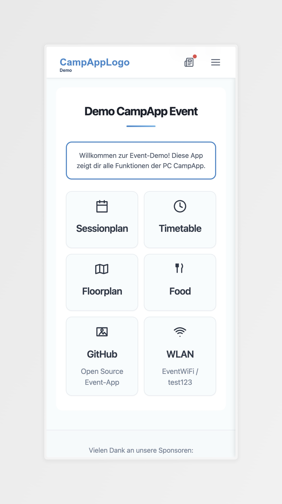
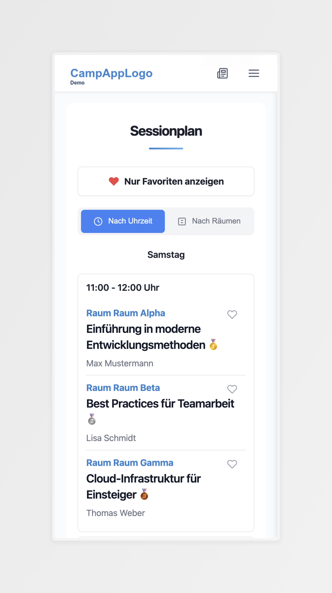
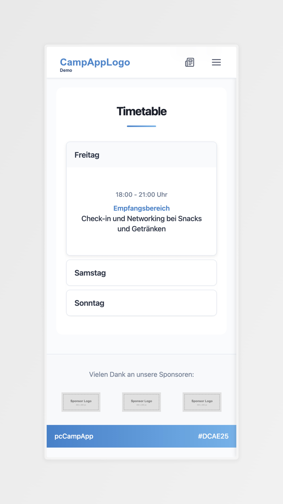
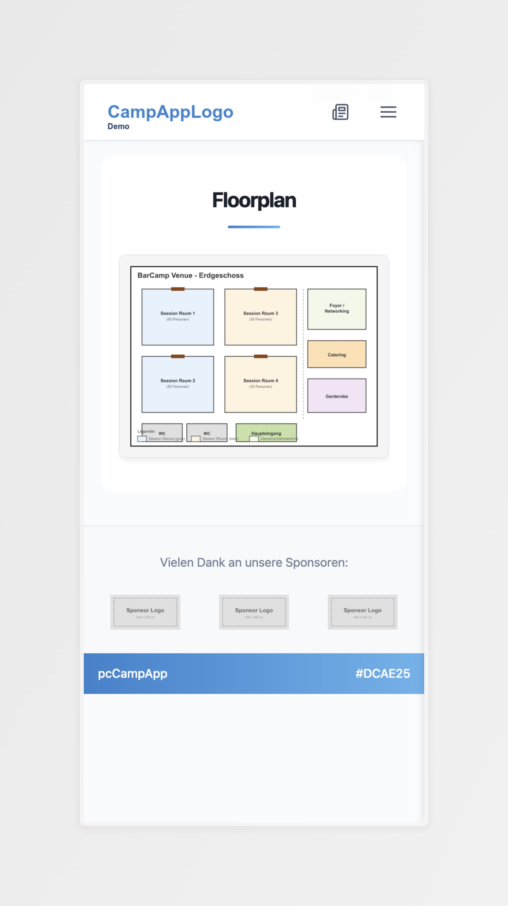
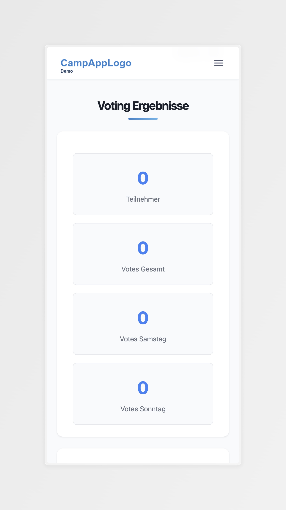

# PC CampApp

[](CHANGELOG.md) [](https://web.dev/progressive-web-apps/) [](https://playwright.dev/) [](LICENSE) [](https://www.php.net/) [](https://www.docker.com/)

---

## 🌟 Features

- **📱 Progressive Web App** - Installierbar auf allen Geräten, funktioniert offline
- **🔄 Vollständig Wiederverwendbar** - Eine einzige `event.json` für jede Veranstaltung
- **🌍 Mehrsprachig** - Integrierte i18n-Unterstützung (Deutsch/Englisch)
- **⚡ Performance-Optimiert** - Cache-Busting, Service Worker, Lazy Loading
- **📊 Event-Features** - Sessionpläne, Zeitpläne, Speisekarten, Sponsoren, Voting
- **🎨 Auto-Branding** - PWA-Icons werden automatisch aus einem einzigen Quellbild generiert
- **🧪 100% Getestet** - Playwright-Tests für Übersetzungen, PWA, UI/UX
- **🐳 Docker Ready** - Entwicklungsumgebung mit einem Befehl

---

**Live-Demo: [https://app.devops-camp.de](https://app.devops-camp.de)**

---

## 📋 Inhaltsverzeichnis

- [Quick Start](#-quick-start)
- [Screenshots](#-screenshots)
- [Konfiguration](#konfiguration)
  - [Anpassung für Ihre Veranstaltung](#anpassung-für-ihre-veranstaltung)
  - [Eventspezifische JSON-Dateien](#eventspezifische-json-dateien)
  - [JSON-Dateien für neue Events anpassen](#json-dateien-für-neue-events-anpassen)
- [Voting-System](#-voting-system)
  - [Aktivierung](#aktivierung)
  - [Voting-Konfiguration](#voting-konfiguration)
  - [Nutzung](#nutzung)
  - [Admin-Bereich](#admin-bereich)
  - [Deployment](#deployment)
- [Entwicklung](#-entwicklung)
  - [Befehle](#befehle)
- [Internationalisierung (i18n)](#-internationalisierung-i18n)
  - [Unterstützte Sprachen](#unterstützte-sprachen)
  - [i18n-Konfiguration](#i18n-konfiguration)
  - [Übersetzungen hinzufügen](#übersetzungen-hinzufügen)
- [Architektur](#️-architektur)
  - [Tech-Stack](#tech-stack)
  - [Caching-Strategie](#caching-strategie)
  - [PWA-Features](#pwa-features)
- [Lizenz](#-lizenz)

---

## 🚀 Quick Start

```bash
# 1. Repository klonen
git clone <repository-url>
cd pccampapp

# 2. Entwicklungsserver starten (Docker)
make dev-up

# 3. Browser öffnen
open http://localhost:5173
```

**Das war's!** Die App läuft jetzt mit Live-Reload.

---

## 🚀 Screenshots

<details>
<summary>Screenshots anzeigen</summary>





</details>

---

## ⚙️ Konfiguration

Die gesamte App ist **konfigurationsgesteuert** über eine einzige Datei: `event.json`

### Anpassung für Ihre Veranstaltung

```bash
# 1. Event-Konfiguration bearbeiten
vim event.json

# 2. Branding-Assets ersetzen (nur 2 Dateien!)
cp ihr-logo.png src/assets/logo.png
cp ihr-icon.png src/assets/icon.png  # PWA-Icons werden automatisch generiert!

# 3. Eventspezifische Inhalte aktualisieren
vim src/sessionplan/sessions.json    # Sessionplan-Daten
vim src/timetable/timetable.json     # Zeitplan-Daten
vim src/news.json                    # Event-News
vim src/menu.json                    # Navigation
vim src/food/menue.json              # Speisekarten
vim src/food/allergene.json          # Allergen-Informationen
vim src/sponsors/sponsors.json       # Sponsoren-Liste

# 4. Bauen & deployen
make build
```

**Keine Code-Änderungen nötig!** Das Build-System automatisch:

- Ersetzt alle `{{EVENT_NAME}}`-Platzhalter in HTML
- Generiert PWA-Manifest aus der Konfiguration
- Erstellt alle PWA-Icons (16x16, 144x144, 192x192, 512x512)
- Wendet Theme-Farben an

### Eventspezifische JSON-Dateien

Die App verwendet mehrere JSON-Dateien für eventspezifische Inhalte. Diese müssen für jede neue Veranstaltung angepasst werden:

#### 📅 Sessionplan (`src/sessionplan/sessions.json`)

Strukturiert Sessions nach Tagen und Zeitslots:

```json
{
  "samstag": {
    "11:00 - 12:00": [
      {
        "id": "10",
        "room": "Raum Alpha",
        "title": "Einführung in moderne Entwicklungsmethoden",
        "host": "Max Mustermann",
        "votes": 0,
        "cancelled": false
      }
    ]
  },
  "sonntag": {
    "10:00 - 11:00": [
      {
        "id": "100",
        "room": "Raum Beta",
        "title": "Erfahrungsaustausch",
        "host": "Lisa Schmidt",
        "votes": 0,
        "cancelled": false
      }
    ]
  }
}
```

#### ⏰ Zeitplan (`src/timetable/timetable.json`)

Zeitplan für das gesamte Event:

```json
{
  "freitag": {
    "18:00 - 21:00 Uhr": [
      {
        "room": "Empfangsbereich",
        "title": "Check-in und Networking"
      }
    ]
  },
  "samstag": {
    "09:30 Uhr": [
      {
        "room": "Hauptraum",
        "title": "Begrüßung und Vorstellungsrunde"
      }
    ]
  }
}
```

#### 📰 News (`src/news.json`)

Event-News mit Zeitfenstern:

```json
{
  "permanent": [
    {
      "id": "1",
      "content": "Willkommen zur Event-Demo!",
      "priority": "medium"
    }
  ],
  "days": {
    "2025-11-15": [
      {
        "id": "10",
        "content": "Die Türen öffnen um 18:00 Uhr.",
        "timeFrom": "16:00",
        "timeTo": "20:00",
        "priority": "high"
      }
    ]
  }
}
```

#### 🍽️ Speisekarten (`src/food/menue.json`)

Menü nach Tagen und Mahlzeiten:

```json
{
  "samstag": {
    "Frühstück": [
      {
        "name": "Brötchen-Auswahl",
        "variants": [
          {
            "name": "Vollkorn",
            "allergens": ["A"]
          }
        ]
      }
    ],
    "Mittagessen": [
      {
        "name": "Pasta-Station",
        "variants": [
          {
            "name": "Bolognese",
            "allergens": ["A", "G", "I"]
          }
        ]
      }
    ]
  }
}
```

#### 🚨 Allergene (`src/food/allergene.json`)

Allergen-Codes und Beschreibungen:

```json
{
  "A": "Glutenhaltiges Getreide",
  "C": "Eier",
  "G": "Milch",
  "I": "Fleisch",
  "L": "Schwefeldioxid und Sulfite"
}
```

#### ⭐ Sponsoren (`src/sponsors/sponsors.json`)

Sponsoren-Liste:

```json
{
  "sponsors": [
    {
      "name": "Sponsor 1",
      "logo": "sponsor-placeholder.png",
      "url": "https://example.com",
      "beschreibung": "Beschreibung des Sponsors"
    }
  ]
}
```

#### 🧭 Navigation (`src/menu.json`)

Hauptnavigation der App:

```json
{
  "items": [
    {
      "title": "Sessionplan",
      "url": "/sessionplan/",
      "description": "",
      "icon": "calendar",
      "active": true
    },
    {
      "title": "WLAN",
      "url": "",
      "description": "EventWiFi / test123",
      "icon": "wifi",
      "active": true
    }
  ]
}
```

### JSON-Dateien für neue Events anpassen

**Schritt-für-Schritt-Anleitung:**

1. **Sessionplan aktualisieren** (`src/sessionplan/sessions.json`):
   - Tage anpassen (z.B. `samstag`, `sonntag` → `freitag`, `samstag`)
   - Zeitslots anpassen (z.B. `11:00 - 12:00` → `10:00 - 11:00`)
   - Raum-Namen aktualisieren
   - Session-Titel, Hosts und IDs anpassen

2. **Zeitplan erstellen** (`src/timetable/timetable.json`):
   - Event-Tage definieren
   - Zeitslots mit Räumen und Aktivitäten hinzufügen
   - Struktur: `"Tag": { "Zeit": [{"room": "Raum", "title": "Aktivität"}] }`

3. **News konfigurieren** (`src/news.json`):
   - Permanente News in `permanent` Array
   - Tages-spezifische News in `days` Objekt
   - Zeitfenster mit `timeFrom`/`timeTo` (optional)
   - Prioritäten: `high`, `medium`, `low`

4. **Speisekarten erstellen** (`src/food/menue.json`):
   - Mahlzeiten nach Tagen strukturieren
   - Allergen-Codes aus `allergene.json` verwenden
   - Varianten für verschiedene Optionen

5. **Sponsoren hinzufügen** (`src/sponsors/sponsors.json`):
   - Logo-Dateien in `src/sponsors/` ablegen
   - URLs und Beschreibungen anpassen

6. **Navigation anpassen** (`src/menu.json`):
   - Menüpunkte aktivieren/deaktivieren
   - URLs und Beschreibungen aktualisieren
   - WLAN-Informationen anpassen

**Tipp:** Alle JSON-Dateien werden automatisch gehasht und gecacht. Nach Änderungen `make build` ausführen!

---

## 🗳️ Voting-System

Das Voting-System ermöglicht es Teilnehmern, Sessions zu bewerten und die beliebtesten Sessions zu ermitteln.

### Aktivierung

Das Voting-System kann über `event.json` die zeitgesteuer aktiviert werden:

```json
{
  "features": {
    "voting": true,
    "votingSchedule": [
      {
        "day": "samstag",
        "dayLabel": "Samstag",
        "dayOfWeek": 6,
        "startTime": "16:00",
        "endTime": "17:45"
      }
    ],
    "votingAdminKey": "dein-geheimes-admin-passwort"
  }
}
```

Zusätzlich kann das Voting auch über den Admin-Bereich de/aktiviert oder beendet werden.

### Voting-Konfiguration

- **voting:** Aktiviert/deaktiviert das Voting-System
- **votingSchedule:** Zeitfenster für Abstimmungen
  - `day`: Interner Tag-Name (z.B. "samstag")
  - `dayLabel`: Anzeige-Name (z.B. "Samstag")
  - `dayOfWeek`: Wochentag als Zahl (0=Sonntag, 6=Samstag)
  - `startTime` / `endTime`: Zeitfenster für Abstimmungen
- **votingAdminKey:** Geheimes Passwort für Admin-Bereich

### Nutzung

**Von Teilnehmern:**

- Voting-Button erscheint im Sessionplan während der konfigurierten Zeitfenster
- Jeder Teilnehmer kann **eine Stimme pro Tag** abgeben
- Abstimmung erfolgt via Browser-Fingerprint (anonymisiert)
- Top 3 Sessions werden mit Medaillen (🥇🥈🥉) angezeigt

### Admin-Bereich

**Zugriff auf Admin-Bereich und Ergebnisse:**

```text
http://localhost:5173/votes/admin.php?key=DEIN-ADMIN-PASSWORT
```

**Features:**

- Live-Statistik der des Votings
- De/aktivieren und Beenden von Votings
- Übermitteln der Ergebnisse in die `sessions.json` für Winner-Badge-Anzeige (TOP3)

**Deployment:**

Die `votes.json` und `voting-state.json` sollten bei einem Deployment nicht überschrieben werden

---

## 💻 Entwicklung

### Befehle

#### Setup & Build

| Befehl | Beschreibung |
|---------|-------------|
| `make install` | Node.js Dependencies installieren |
| `make build` | Produktionsversion bauen (Cache-Busting) |
| `make clean` | Vollständige Bereinigung (node_modules, build, Docker) |
| `make generate-icons` | PWA-Icons aus icon.png generieren |

#### Development (Port 5173 - src/)

| Befehl | Beschreibung |
|---------|-------------|
| `make dev-up` | Entwicklungsserver starten |
| `make dev-down` | Entwicklungsserver stoppen |
| `make dev-rebuild` | Docker Image neu bauen (ohne Cache) |
| `make dev-logs` | Live-Logs anzeigen |
| `make dev-remove` | Container + Volumes entfernen |

#### Production Testing (Port 5174 - build/)

| Befehl | Beschreibung |
|---------|-------------|
| `make prod-up` | Production-Test-Server starten (inkl. Build) |
| `make prod-down` | Production-Test-Server stoppen |
| `make prod-rebuild` | Docker Image neu bauen (ohne Cache) |
| `make prod-logs` | Live-Logs anzeigen |
| `make prod-remove` | Container + Volumes entfernen |

#### Testing

| Befehl | Beschreibung |
|---------|-------------|
| `make test` | Standard Tests (79 Tests, Port 5174, nginx) |
| `make test-php` | PHP Tests (24 Tests, Port 5175, PHP-Server) |
| `make test-translations` | Übersetzungs-Tests (42 Tests, DE + EN) |
| `make test-translations-de` | Übersetzungs-Tests nur Deutsch (21 Tests) |
| `make test-translations-en` | Übersetzungs-Tests nur Englisch (21 Tests) |
| `make test-all` | Alle Tests (145 Tests, Standard + PHP + Translations) |
| `make test-headed` | Standard Tests mit sichtbarem Browser |
| `make test-php-headed` | PHP Tests mit sichtbarem Browser |
| `make test-report` | HTML Test-Report öffnen |

---

## 🌍 Internationalisierung (i18n)

### Unterstützte Sprachen

- 🇩🇪 Deutsch (`de`)
- 🇬🇧 Englisch (`en`)

### i18n-Konfiguration

Sprache in `event.json` festlegen:

```json
{
  "event": {
    "locale": "de"
  }
}
```

### Übersetzungen hinzufügen

1. Schlüssel zu `src/translations/de.json` hinzufügen:

   ```json
   {
     "myFeature": {
       "title": "Mein Feature"
     }
   }
   ```

2. Denselben Schlüssel zu `src/translations/en.json` hinzufügen:

   ```json
   {
     "myFeature": {
       "title": "My Feature"
     }
   }
   ```

3. In HTML verwenden:

   ```html
   <h1 data-i18n="myFeature.title">My Feature</h1>
   ```

4. Überprüfen:

   ```bash
   make test
   ```

---

## 🏗️ Architektur

### Tech-Stack

- **Frontend:** Vanilla JavaScript (keine Frameworks!)
- **Styling:** Reines CSS (keine Präprozessoren)
- **Backend:** PHP (nur Voting-System)
- **PWA:** Service Worker, Web App Manifest
- **Build:** Node.js (Cache-Busting, Icon-Generierung)
- **Testing:** Playwright (Cross-Browser)
- **Server:** nginx (Docker für Entwicklung)

### Caching-Strategie

**3-Schichten-Caching-System:**

1. **Service Worker Cache** - Offline-Funktionalität
2. **localStorage Cache** - JSON-Daten (1-Stunden-TTL)
3. **Cache Busting** - MD5-gehashte Dateinamen

Beispiel:

- `app.css` → `app.b417865e.css`
- `menu.json` → `menu.ec9daa78.json`
- `header.js` → `header.e3796179.js`

Alle Hash-Updates erfolgen automatisch während des Builds!

### PWA-Features

- ✅ **Installierbar** - Zum Startbildschirm hinzufügen (Android, iOS, Desktop)
- ✅ **Offline-First** - Funktioniert ohne Internet
- ✅ **Schnell** - Gecachte Assets, sofortiges Laden
- ✅ **Responsiv** - Mobil, Tablet, Desktop
- ✅ **Sicher** - HTTPS erforderlich
- ✅ **Auto-Updates** - Service Worker Updates

---

## 📄 Lizenz

Dieses Projekt ist lizenziert unter der **GNU Affero General Public License v3.0 (AGPL-3.0)**.

### Was bedeutet das?

- ✅ **Freie Nutzung** - Sie können die Software frei verwenden, modifizieren und verteilen
- ✅ **Open Source** - Der Quellcode bleibt immer verfügbar
- ✅ **SaaS-geschützt** - Auch bei Web-Service-Betrieb muss der Code offengelegt werden
- ⚠️ **Copyleft** - Änderungen müssen unter derselben Lizenz veröffentlicht werden
- ⚠️ **Netzwerk-Nutzung** - Bei SaaS-Betrieb muss ein Link zum Quellcode bereitgestellt werden

Für **Closed-Source** oder **proprietäre** Nutzung ist eine separate kommerzielle Lizenz erforderlich.

Siehe [LICENSE](LICENSE) für den vollständigen Lizenztext.

---

Mit ❤️ entwickelt für das [DevOps Camp](https://devops-camp.de).

© [Proud Commerce](https://www.proudcommerce.com) | 2025
